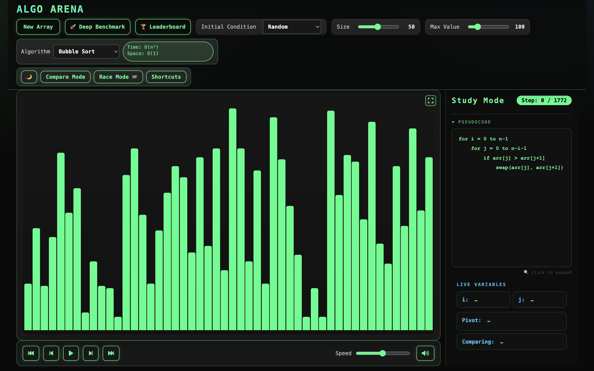

# ALGO ARENA


An interview-ready, full-stack algorithm visualization and benchmarking arena with modern UI and production-grade Spring Boot services.

🚀 **Live Demo**: [algo-arena-sorting.vercel.app](https://algo-arena-sorting.vercel.app)  
🔧 **Backend API**: [Railway](https://algoarena-production-3419.up.railway.app)  
📂 **Source Code**: [github.com/YamHainHum/AlgoArena](https://github.com/YamHainHum/AlgoArena)

[](https://vercel.com)
[](https://railway.app)

## Table of Contents
- [✨ Features](#-features)
- [🛠 Tech Stack](#-tech-stack)
- [🏗 Architecture & Design Patterns](#-architecture--design-patterns)
- [🚀 Getting Started](#-getting-started)
- [📈 Performance Benchmarks](#-performance-benchmarks)
- [🌐 API Endpoints](#-api-endpoints)
- [🔎 Benchmark API Example](#-benchmark-api-example)
- [🗂 Project Structure](#-project-structure)
- [🎯 Why This Project?](#-why-this-project)
- [🧰 Troubleshooting](#-troubleshooting)
- [📜 License & Credits](#-license--credits)

## ✨ Features
### Frontend
- Visual, Compare, Race, Study, and Analytics modes with clean mode isolation
- Deep Benchmark modal for multi-algorithm timing and metrics
- Dark theme UI, keyboard shortcuts, fullscreen chart panel
- CSS Grid/Flexbox layouts for responsive 2x3 race panels
- Chart.js-powered analytics dashboard

### Backend
- Spring Boot 3 REST API with controller/service/DTO layers
- Benchmark engine with pluggable `SortAlgorithm` components
- Spring Data JPA repositories with H2 in-memory database
- Global CORS configuration for easy local development

### Performance & UX
- Concurrent benchmarking via `CompletableFuture` and worker thread pool
- `@Async`-powered analytics race execution
- Thread-safe benchmark metrics using `AtomicLong`
- Fire-and-forget leaderboard persistence for non-blocking UI

## 🛠 Tech Stack
| Layer | Technology | Version/Notes |
| --- | --- | --- |
| Backend | Java | 17 |
| Backend | Spring Boot | 3.2.0 |
| Backend | Spring Data JPA | Spring Boot Starter |
| Backend | H2 | Runtime in-memory DB |
| Backend | Lombok | 1.18.32 |
| Build | Maven | Pom-based build |
| Frontend | HTML/CSS/JS | Vanilla (no build step) |
| Frontend | Chart.js | CDN (version not pinned) |
| Frontend | Font Awesome | 6.0.0 |

## 🏗 Architecture & Design Patterns
- Spring MVC layering: `Controller` → `Service` → `Repository`
- DTO boundary for benchmarks and leaderboard payloads
- Strategy-style benchmark engines via `SortAlgorithm` components
- Async execution with `@Async` and `CompletableFuture` on a dedicated worker pool
- Thread-safe metrics with `AtomicLong`
- Frontend state machine with isolated Visual/Compare/Race/Analytics modes

## 🚀 Getting Started
### Prerequisites
- Java 17
- Maven

### Backend
```bash
cd AlgoArena
mvn spring-boot:run
```
Backend runs at: http://localhost:8080

Optional package and run:
```bash
mvn -DskipTests package
java -jar target/backend-1.0.0.jar
```

### Frontend
Static UI (no build step). Serve the `frontend` directory:
```bash
cd AlgoArena/frontend
python3 -m http.server 5500
```
Open: http://localhost:5500

### Database
- H2 in-memory database
- JDBC URL: `jdbc:h2:mem:algoarena;DB_CLOSE_DELAY=-1;DB_CLOSE_ON_EXIT=FALSE`
- Username: `sa`
- Password: (empty)
- H2 Console: http://localhost:8080/h2-console

## 📈 Performance Benchmarks
Sample Deep Benchmark timings (local machine, Java 17). Results vary by hardware and dataset characteristics.

| Dataset Size | Example Timing Range (ms) | Notes |
| --- | --- | --- |
| 10,000 | 5 - 40 | Quick/Merge/Heap typically dominate |
| 100,000 | 60 - 260 | Larger arrays magnify algorithmic differences |
| 500,000 | 420 - 1,800 | Approaches max benchmark size |

## 🌐 API Endpoints
| Method | Endpoint | Description |
| --- | --- | --- |
| POST | `/api/sort` | Run sorting on input array for selected algorithms |
| POST | `/api/benchmark` | Deep Benchmark with size/max/condition and algorithms |
| POST | `/api/leaderboard/race-result` | Persist race result |
| GET | `/api/leaderboard/global` | Global leaderboard aggregation |
| GET | `/api/leaderboard/my?username=` | User-specific race history |
| POST | `/api/analytics/race` | Analytics race (Quick/Merge/Heap) |
| GET | `/api/analytics/leaderboard` | Analytics leaderboard (top 30) |

## 🔎 Benchmark API Example
Request:
```json
{
	"size": 120000,
	"maxValue": 500,
	"initialCondition": "RANDOM",
	"algorithms": ["QUICK_SORT", "MERGE_SORT", "HEAP_SORT"]
}
```
Response:
```json
{
	"arraySize": 120000,
	"results": [
		{ "algorithm": "QUICK_SORT", "timeMs": 80, "comparisons": 123456, "swaps": 45678 },
		{ "algorithm": "MERGE_SORT", "timeMs": 95, "comparisons": 120012, "swaps": 60000 },
		{ "algorithm": "HEAP_SORT", "timeMs": 140, "comparisons": 210000, "swaps": 90000 }
	]
}
```

## 🗂 Project Structure
```
AlgoArena/
├── frontend/
│   ├── index.html
│   ├── script.js
│   └── style.css
├── src/
│   └── main/
│       ├── java/
│       │   └── com/algoarena/backend/
│       │       ├── benchmark/
│       │       ├── config/
│       │       ├── controller/
│       │       ├── dto/
│       │       ├── model/
│       │       ├── repository/
│       │       └── service/
│       └── resources/
│           └── application.properties
├── pom.xml
└── README.md
```

## 🎯 Why This Project?
- Demonstrates production-ready Spring Boot layering with DTOs, services, and repositories
- Shows asynchronous, multi-threaded benchmarking with safe metrics collection
- Highlights API design, validation, and CORS configuration for real-world frontend integration

## 📸 Screenshots


## 🧰 Troubleshooting
- **Deep Benchmark shows Failed to fetch**: Ensure backend is running on port 8080 (`mvn spring-boot:run`).
- **Port 8080 already in use**: Stop the existing service or change `server.port` in [src/main/resources/application.properties](src/main/resources/application.properties).
- **H2 console login fails**: Use JDBC URL `jdbc:h2:mem:algoarena` and username `sa` with empty password.
- **Lombok compilation errors**: Ensure annotation processing is enabled in your IDE.

## 📜 License & Credits
### 👤 Author
**Shubham Kumar**  
🚀 **Live Project**: [algo-arena-sorting.vercel.app](https://algo-arena-sorting.vercel.app)  
[🔗 GitHub](https://github.com/YamHainHum) • [💼 LinkedIn](https://www.linkedin.com/in/shubhamkumar-dev-mca/)

### 📄 License
This project is open-source under the [MIT License](LICENSE).

### 🛠 Built With
| Layer | Technologies |
|-------|-------------|
| Backend | Java 17, Spring Boot 3, Spring Data JPA, H2, Lombok |
| Frontend | Vanilla JavaScript, CSS Grid/Flexbox, Chart.js, Font Awesome |
| Build | Maven, Git |

### 🙏 Acknowledgments
- Chart.js for beautiful data visualization
- Font Awesome for icons
- Spring community for excellent documentation
- Open-source algorithm resources for inspiration
